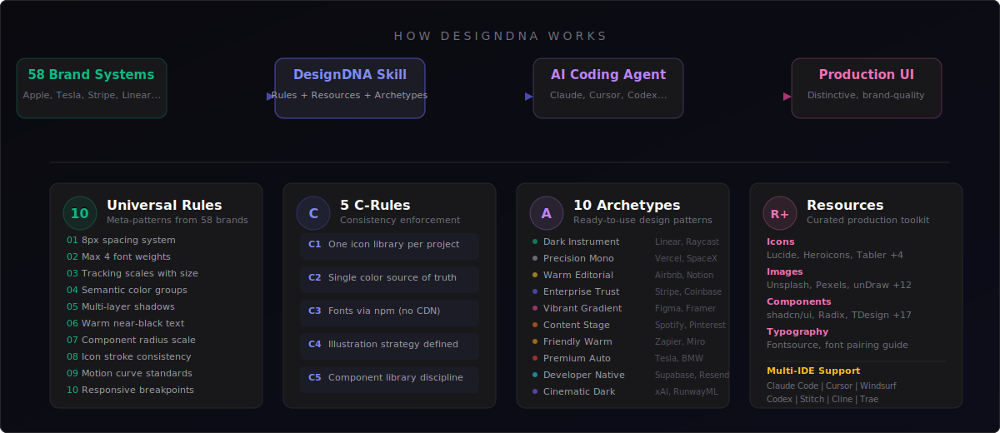

<div align="center">
  
</div>

<br/>

<div align="center">

[](LICENSE)


[](https://github.com/tiantangcao1980-web/DesignDNA-Skills)
[](https://github.com/tiantangcao1980-web/DesignDNA-Skills/stargazers)

</div>

<br/>

<h1 align="center">Design systems as AI skills</h1>

<p align="center">
  <strong>Teach your AI agent to build UI like Apple, Tesla, Stripe, Linear &mdash; in one command.</strong>
</p>

<br/>

## Quick Install

```bash
# Add a brand design system to your project
npx designdna add stripe

# Or pick interactively from 58 brands
npx designdna init

# Or install the full skill into your AI IDE
npx designdna install --ide=claude-code
```

<details>
<summary><strong>Manual install (no CLI)</strong></summary>

<br/>

| AI Editor | File to copy | Destination |
|---|---|---|
| Claude Code | `designdna/SKILL.md` | `~/.claude/skills/designdna/` |
| Cursor | `designdna/.cursorrules` | Project root as `.cursorrules` |
| Windsurf | `designdna/.cursorrules` | Project root |
| Codex / OpenAI | `designdna/AGENTS.md` | Project root as `AGENTS.md` |
| Google Stitch | `design-md/{brand}/DESIGN.md` | Drop into Stitch project |
| Any agent | `designdna/rules.md` | Project root |

For brand-specific design systems, copy `design-md/{brand}/DESIGN.md` into your project root.

</details>

<br/>

## Why DesignDNA?

AI agents produce UI that all looks the same &mdash; safe colors, centered layouts, predictable spacing. The root cause: **agents lack design taste.**

DesignDNA distills **58 world-class brand design systems** into structured AI skills that any coding agent can read and apply. Instead of generic AI aesthetics, you get Apple's precision, Stripe's trust, Linear's minimalism &mdash; on demand.

<br/>

<div align="center">
  
</div>

<br/>

---

## What you get

| Capability | Raw DESIGN.md files | DesignDNA |
|---|---|---|
| Brand design systems | 58 markdown files | 58 × 5 formats (MD, JSON, CSS, Tailwind, TS) |
| Universal design rules | &mdash; | 10 meta-patterns extracted across all brands |
| Consistency enforcement | &mdash; | 5 C-Rules preventing design drift |
| Resource library | &mdash; | Icons, images, components, fonts, animations |
| Design archetypes | &mdash; | 10 ready-to-use reference patterns |
| Multi-IDE support | GitHub only | Claude Code, Cursor, Windsurf, Codex, Stitch |
| CLI installation | &mdash; | `npx designdna add <brand>` |
| Interactive Playground | Static gallery | Parameter sliders + live code export |

---

## 30-second tour

**1. Pick a brand** &mdash; run `npx designdna list` or browse the [Playground](https://tiantangcao1980-web.github.io/DesignDNA-Skills/).

**2. Install into your project:**

```bash
npx designdna add stripe --format=tailwind
# ✓ Created DESIGN.md
# ✓ Created tailwind.config.js
# ✓ Created variables.css
# ✓ Installed skill into .cursorrules
```

**3. Tell your AI agent:**

> "Build me a pricing page following DESIGN.md"

Your agent now generates UI with Stripe's signature purple gradients, weight-300 elegance, and proper spacing &mdash; not a generic centered card.

---

## Brand catalog (58)

| Category | Brands |
|---|---|
| **AI & ML** | Claude, Cohere, ElevenLabs, Minimax, Mistral AI, Ollama, OpenCode AI, Replicate, RunwayML, Together AI, VoltAgent, xAI |
| **Dev Tools** | Cursor, Expo, Linear, Lovable, Mintlify, PostHog, Raycast, Resend, Sentry, Supabase, Superhuman, Vercel, Warp, Zapier |
| **Infra & Cloud** | ClickHouse, Composio, HashiCorp, MongoDB, Sanity, Stripe |
| **Design & Productivity** | Airtable, Cal.com, Clay, Figma, Framer, Intercom, Miro, Notion, Pinterest, Webflow |
| **Fintech & Crypto** | Coinbase, Kraken, Revolut, Wise |
| **Consumer & Enterprise** | Airbnb, Apple, IBM, NVIDIA, SpaceX, Spotify, Uber |
| **Automotive** | BMW, Ferrari, Lamborghini, Renault, Tesla |

Browse the full interactive gallery at **[Playground](https://tiantangcao1980-web.github.io/DesignDNA-Skills/)** or explore the [`design-md/`](./design-md/) directory.

<details>
<summary><strong>Full brand list with descriptions</strong></summary>

<br/>

### AI & Machine Learning

- [**Claude**](design-md/claude/) &mdash; Anthropic's AI assistant. Warm terracotta accent, clean editorial layout
- [**Cohere**](design-md/cohere/) &mdash; Enterprise AI platform. Vibrant gradients, data-rich dashboard aesthetic
- [**ElevenLabs**](design-md/elevenlabs/) &mdash; AI voice platform. Dark cinematic UI, audio-waveform aesthetics
- [**Minimax**](design-md/minimax/) &mdash; AI model provider. Bold dark interface with neon accents
- [**Mistral AI**](design-md/mistral.ai/) &mdash; Open-weight LLM provider. French-engineered minimalism, purple-toned
- [**Ollama**](design-md/ollama/) &mdash; Run LLMs locally. Terminal-first, monochrome simplicity
- [**OpenCode AI**](design-md/opencode.ai/) &mdash; AI coding platform. Developer-centric dark theme
- [**Replicate**](design-md/replicate/) &mdash; Run ML models via API. Clean white canvas, code-forward
- [**RunwayML**](design-md/runwayml/) &mdash; AI video generation. Cinematic dark UI, media-rich layout
- [**Together AI**](design-md/together.ai/) &mdash; Open-source AI infrastructure. Technical, blueprint-style design
- [**VoltAgent**](design-md/voltagent/) &mdash; AI agent framework. Void-black canvas, emerald accent, terminal-native
- [**xAI**](design-md/x.ai/) &mdash; Elon Musk's AI lab. Stark monochrome, futuristic minimalism

### Developer Tools & Platforms

- [**Cursor**](design-md/cursor/) &mdash; AI-first code editor. Sleek dark interface, gradient accents
- [**Expo**](design-md/expo/) &mdash; React Native platform. Dark theme, tight letter-spacing, code-centric
- [**Linear**](design-md/linear.app/) &mdash; Project management for engineers. Ultra-minimal, precise, purple accent
- [**Lovable**](design-md/lovable/) &mdash; AI full-stack builder. Playful gradients, friendly dev aesthetic
- [**Mintlify**](design-md/mintlify/) &mdash; Documentation platform. Clean, green-accented, reading-optimized
- [**PostHog**](design-md/posthog/) &mdash; Product analytics. Playful hedgehog branding, developer-friendly dark UI
- [**Raycast**](design-md/raycast/) &mdash; Productivity launcher. Sleek dark chrome, vibrant gradient accents
- [**Resend**](design-md/resend/) &mdash; Email API for developers. Minimal dark theme, monospace accents
- [**Sentry**](design-md/sentry/) &mdash; Error monitoring. Dark dashboard, data-dense, pink-purple accent
- [**Supabase**](design-md/supabase/) &mdash; Open-source Firebase alternative. Dark emerald theme, code-first
- [**Superhuman**](design-md/superhuman/) &mdash; Fast email client. Premium dark UI, keyboard-first, purple glow
- [**Vercel**](design-md/vercel/) &mdash; Frontend deployment platform. Black and white precision, Geist font
- [**Warp**](design-md/warp/) &mdash; Modern terminal. Dark IDE-like interface, block-based command UI
- [**Zapier**](design-md/zapier/) &mdash; Automation platform. Warm orange, friendly illustration-driven

### Infrastructure & Cloud

- [**ClickHouse**](design-md/clickhouse/) &mdash; Fast analytics database. Yellow-accented, technical documentation style
- [**Composio**](design-md/composio/) &mdash; Tool integration platform. Modern dark with colorful integration icons
- [**HashiCorp**](design-md/hashicorp/) &mdash; Infrastructure automation. Enterprise-clean, black and white
- [**MongoDB**](design-md/mongodb/) &mdash; Document database. Green leaf branding, developer documentation focus
- [**Sanity**](design-md/sanity/) &mdash; Headless CMS. Red accent, content-first editorial layout
- [**Stripe**](design-md/stripe/) &mdash; Payment infrastructure. Signature purple gradients, weight-300 elegance

### Design & Productivity

- [**Airtable**](design-md/airtable/) &mdash; Spreadsheet-database hybrid. Colorful, friendly, structured data aesthetic
- [**Cal.com**](design-md/cal/) &mdash; Open-source scheduling. Clean neutral UI, developer-oriented simplicity
- [**Clay**](design-md/clay/) &mdash; Creative agency. Organic shapes, soft gradients, art-directed layout
- [**Figma**](design-md/figma/) &mdash; Collaborative design tool. Vibrant multi-color, playful yet professional
- [**Framer**](design-md/framer/) &mdash; Website builder. Bold black and blue, motion-first, design-forward
- [**Intercom**](design-md/intercom/) &mdash; Customer messaging. Friendly blue palette, conversational UI patterns
- [**Miro**](design-md/miro/) &mdash; Visual collaboration. Bright yellow accent, infinite canvas aesthetic
- [**Notion**](design-md/notion/) &mdash; All-in-one workspace. Warm minimalism, serif headings, soft surfaces
- [**Pinterest**](design-md/pinterest/) &mdash; Visual discovery platform. Red accent, masonry grid, image-first
- [**Webflow**](design-md/webflow/) &mdash; Visual web builder. Blue-accented, polished marketing site aesthetic

### Fintech & Crypto

- [**Coinbase**](design-md/coinbase/) &mdash; Crypto exchange. Clean blue identity, trust-focused, institutional feel
- [**Kraken**](design-md/kraken/) &mdash; Crypto trading platform. Purple-accented dark UI, data-dense dashboards
- [**Revolut**](design-md/revolut/) &mdash; Digital banking. Sleek dark interface, gradient cards, fintech precision
- [**Wise**](design-md/wise/) &mdash; International money transfer. Bright green accent, friendly and clear

### Enterprise & Consumer

- [**Airbnb**](design-md/airbnb/) &mdash; Travel marketplace. Warm coral accent, photography-driven, rounded UI
- [**Apple**](design-md/apple/) &mdash; Consumer electronics. Premium white space, SF Pro, cinematic imagery
- [**IBM**](design-md/ibm/) &mdash; Enterprise technology. Carbon design system, structured blue palette
- [**NVIDIA**](design-md/nvidia/) &mdash; GPU computing. Green-black energy, technical power aesthetic
- [**SpaceX**](design-md/spacex/) &mdash; Space technology. Stark black and white, full-bleed imagery, futuristic
- [**Spotify**](design-md/spotify/) &mdash; Music streaming. Vibrant green on dark, bold type, album-art-driven
- [**Uber**](design-md/uber/) &mdash; Mobility platform. Bold black and white, tight type, urban energy

### Car Brands

- [**BMW**](design-md/bmw/) &mdash; Luxury automotive. Dark premium surfaces, precise German engineering aesthetic
- [**Ferrari**](design-md/ferrari/) &mdash; Luxury automotive. Chiaroscuro black-white editorial, Ferrari Red with extreme sparseness
- [**Lamborghini**](design-md/lamborghini/) &mdash; Luxury automotive. True black cathedral, gold accent, LamboType custom Neo-Grotesk
- [**Renault**](design-md/renault/) &mdash; French automotive. Vivid aurora gradients, NouvelR proprietary typeface, zero-radius buttons
- [**Tesla**](design-md/tesla/) &mdash; Electric vehicles. Radical subtraction, cinematic full-viewport photography, Universal Sans

</details>

---

## What's inside each brand

Every brand directory provides **5 formats** so you can pick what your stack needs:

```
design-md/stripe/
├── DESIGN.md           # Human-readable spec (what AI agents read)
├── design.json         # Design tokens (machine-readable)
├── tailwind.config.js  # Tailwind preset (drop-in)
├── variables.css       # CSS custom properties (drop-in)
├── tokens.ts           # TypeScript design tokens (type-safe)
├── preview.html        # Visual catalog (light)
└── preview-dark.html   # Visual catalog (dark)
```

### The 9-Section DESIGN.md standard

Every DESIGN.md follows the [Stitch DESIGN.md format](https://stitch.withgoogle.com/docs/design-md/format/) extended with these sections:

| # | Section | What it captures |
|---|---------|-----------------|
| 1 | Visual Theme & Atmosphere | Mood, density, design philosophy |
| 2 | Color Palette & Roles | Semantic name + hex + functional role |
| 3 | Typography Rules | Font families, full hierarchy table |
| 4 | Component Stylings | Buttons, cards, inputs, navigation with states |
| 5 | Layout Principles | Spacing scale, grid, whitespace philosophy |
| 6 | Depth & Elevation | Shadow system, surface hierarchy |
| 7 | Do's and Don'ts | Design guardrails and anti-patterns |
| 8 | Responsive Behavior | Breakpoints, touch targets, collapsing strategy |
| 9 | Agent Prompt Guide | Quick color reference, ready-to-use prompts |

---

## Showcase

> Built something with DesignDNA? [Open a PR](https://github.com/tiantangcao1980-web/DesignDNA-Skills/pulls) to add it here.

<table>
  <tr>
    <td align="center" width="33%">
      <em>Your project here</em><br/>
      <sub>Built with <code>npx designdna add stripe</code></sub>
    </td>
    <td align="center" width="33%">
      <em>Your project here</em><br/>
      <sub>Built with <code>npx designdna add linear</code></sub>
    </td>
    <td align="center" width="33%">
      <em>Your project here</em><br/>
      <sub>Built with <code>npx designdna add apple</code></sub>
    </td>
  </tr>
</table>

---

## Project structure

```
DesignDNA-Skills/
├── design-md/              # 58 brand design systems (5 formats each)
├── designdna/              # The portable AI skill
│   ├── SKILL.md            # Claude Code skill
│   ├── AGENTS.md           # Codex / OpenAI format
│   ├── .cursorrules        # Cursor / Windsurf format
│   ├── rules.md            # Generic agent format
│   ├── RESOURCES.md        # Curated resource library
│   └── examples/           # DESIGN.md templates
├── packages/
│   └── cli/                # npx designdna CLI tool
├── playground/             # Interactive brand explorer
└── assets/                 # Banners & diagrams
```

---

## Request a brand

[Open an issue](https://github.com/tiantangcao1980-web/DesignDNA-Skills/issues/new?template=design-md-request.yml) with the website URL to request a new DESIGN.md.

---

## Acknowledgments

This project stands on the shoulders of great work:

- **[Awesome DESIGN.md](https://github.com/VoltAgent/awesome-design-md)** &mdash; The original curated collection by the [VoltAgent](https://github.com/VoltAgent) team, which extracted design systems from 58 world-class brand websites into structured DESIGN.md format. Without their foundational work, this project would not exist.
- **[Google Stitch](https://stitch.withgoogle.com/docs/design-md/overview/)** &mdash; For introducing the [DESIGN.md format](https://stitch.withgoogle.com/docs/design-md/format/) that makes design systems readable by AI agents.
- **[React Bits](https://github.com/DavidHDev/react-bits)** &mdash; For showing how a curated, multi-variant component library can achieve developer delight.
- **[Remotion](https://github.com/remotion-dev/remotion)** &mdash; For the inspiration on how to turn domain expertise into developer-native tooling.

**What DesignDNA adds:** 10 universal rules, 5 C-Rules, 10 archetypes, multi-format variants (MD/JSON/CSS/Tailwind/TS), CLI scaffolding, and multi-IDE skill distribution &mdash; turning a design reference collection into a plug-and-play AI skill.

## Contributing

See [CONTRIBUTING.md](CONTRIBUTING.md).

## License

MIT &mdash; see [LICENSE](LICENSE).

Design system data represents publicly visible CSS values from brand websites. No claim of ownership over any brand's visual identity.
